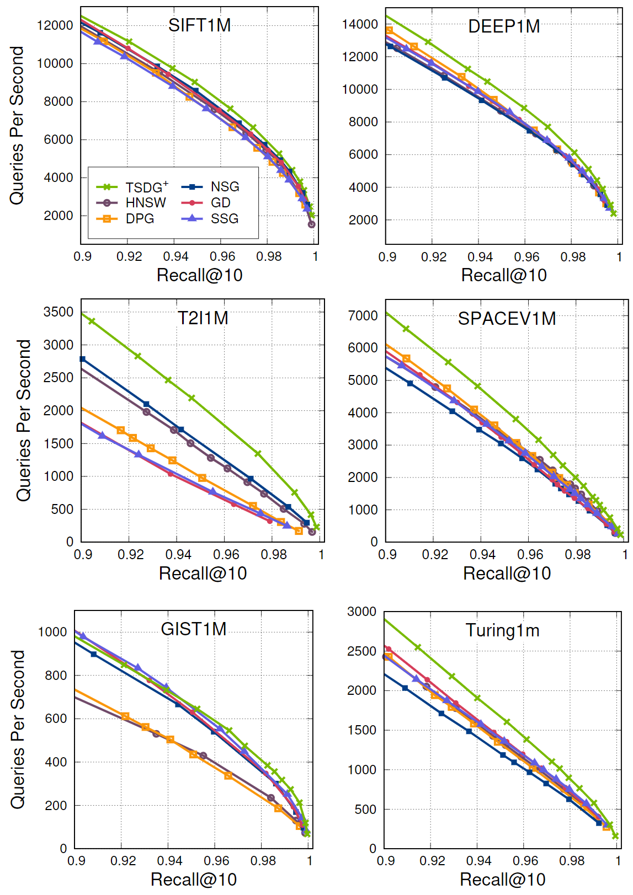

# TSDG

## Introduction

TSDG is an index graph for graph-based approximate nearest neighbor search, which is fast to build, efficient to search, and GPU friendly.

## Building

```shell
$ cd tsdg
$ mkdir build && cd build
$ cmake ..
$ make -j
```

## Usage

The demos for building index and searching are under the directory `examples/`

### Building Index

#### **Step 1**. Build Shortcut (SC) Graph

Firstly, we need to prepare a SC-graph. 
The SC-graph need to be built in advance, we constructed SC-graph by modified NN-Descent in `nndescent.hpp`

You can use our example code to build the SC-graph as follows:

```shell
$ build/examples/scg_build DATA_PATH K SAMPLE_NUM ITERATION_NUM ADD_SHORTCUTS OUTPUT_PATH
```

+ `DATA_PATH` is the path of the base data in `fvecs` format.
+ `K` is the number of edges of the SC-Graph.
+ `SAMPLE_NUM` controls the number of samples in each NN-Descent iteration.
+ `ITERATION_NUM` controls the number of NN-Descent iterations.
+ `OUTPUT_PATH` is the path of the generated SC-graph.

An example:
```shell
$ build/examples/scg_build \
    ./data/sift1m/sift1m_base.fvecs \
    200 16 12\
    ./data/sift1m/index/sift1m_scg.ivecs
```

The following are the parameters used for building the augmented *k*-NN graphs on the CPU in our paper.

| Dataset | *`k`* of *k*-NN graph | `SAMPLE_NUM` | `ITERATION_NUM` |
| :----  | :----: | :----: | :----: |
| SIFT1M | 200 |  16  | 10 |
| DEEP1M | 200 |  16  | 10 |
| T2I1M  | 400 |  16  | 10 |
| SPACEV1M | 200 | 20 | 12 |
| GIST1M   | 400 | 16 | 12 |
| Turing1M | 200 | 20 | 15 |

**Note**: The above parameter settings consider the balance of building efficiency and search efficiency, appropriately increasing SAMPLE_NUM and ITERATION_NUM may improve the search efficiency.

The above datasets can be downloaded from http://corpus-texmex.irisa.fr/ and https://big-ann-benchmarks.com/

#### **Step 2**. Convert the augmented *k*-NN graph to TSDG index

Secondly, we will convert the augmented *k*-NN graph to the TSDG index.

You can use our example code to achieve this conversion as follows:
```shell
$ build/examples/tsdg_build DATA_PATH SCG_PATH BUILD_MODE LE_THRESHOLD RANK_THRESHOLD MAX_EDGES OUTPUT_PATH
```

+ `DATA_PATH` is the path of the base data in `fvecs` format.
+ `SCG_PATH` is the path of the pre-built SC-graph in `ivecs` format.
+ `RELAXED_FACTOR` used for first-stage graph diversification, controls the average degree of index graph.
+ `OCCL_THRESHOLD` used for second-stage graph diversification, controls the average degree of index graph.
+ `MAX_EDGES` used for limiting the degree of index graph.
+ `OUTPUT_PATH` is the path of the generated TSDG index.

An example:
```shell
$ build/examples/tsdg_build \
    ./data/sift1m/sift1m_base.fvecs \
    ./data/sift1m/sift1m_scg.ivecs \
    1.2 4 60 \
    ./data/sift1m/index/sift1m.tsdg
```

The parameters `RELAXED_FACTOR` in the source code corresponds to the parameter $\alpha$ for ***Relaxed Graph Diversification*** in the paper.

The parameters `OCCL_THRESHOLD` in the source code corresponds to the parameter $\lambda_0$ for ***Soft Graph Diversification*** in the paper.

The following are the parameters used for building and searching experiments on the CPU.

| Dataset | `RELAXED_FACTOR` | `OCCL_THRESHOLD` | `MAX_EDGES` |
| :----  | :----: | :----: | :----: |
| SIFT1M |  1.2  | 4 | 60 |
| DEEP1M |  1.2  | 4 | 60 |
| T2I1M  |  1.2  | 4 | 60 |
| SPACEV1M | 1.2 | 4 | 80 |
| GIST1M   | 1.1 | 8 | 80 |
| Turing1M | 1.2 | 4 | 80 |

**Note**: The above parameter settings consider the efficiency of graph construction and the consistency of parameters. The search performance is better when the parameter RELAXED_FACTOR of T2I1M and SPACEV1M is 1.3, but it will increase the time of graph construction.

The index graph building time (s) is shown below (including the *k*-NN graph building time):

| Dataset | `TSDG⁺` | `NSG` | `SSG` | `DPG` | `HNSW` |
| :----  | ----: | ----: | ----: | ----: |  ----: |
| SIFT1M |   307.5  | 492.8  | 359.8  | 462.8  | 364.0
| DEEP1M |   282.1  | 449.5  | 320.4  | 400.9  | 326.1
| T2I1M  |   595.1  | 1472.4 | 913.9  | 1888.9 | 937.2
| SPACEV1M | 539.9  | 657.9  | 676.8  | 659.5  | 615.4
| GIST1M   | 1363.7 | 2794.6 | 1728.0 | 6138.7 | 1595.9
| Turing1M | 726.5  | 1267.8 | 1052.9 | 827.6  | 792.7


# Search on the CPU

You can use our demo code to search on graph as follows:

```shell
build/examples/tsdg_search INDEX_PATH QUERY_PATH GROUND_TRUTH_PATH
```

An example:
```shell
$ build/examples/tsdg_search \
    ./data/sift1m/index/sift1m.tsdg \
    ./data/sift1m/sift1m_query.fvecs \
    ./data/sift1m/sift1m_gt.ivecs
```
The performance of the search on the graph is shown below:



# Search on the GPU

Due to licensing issues, this library is not able to provide the code on the GPU, the GPU related code will be open source in the future.